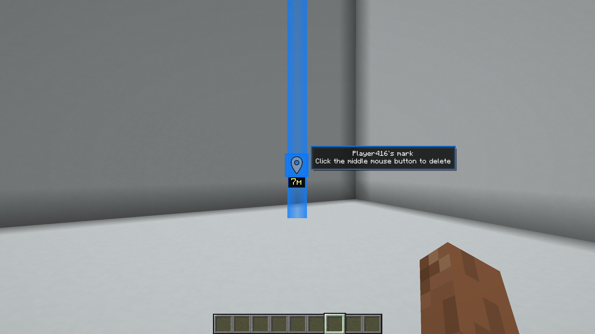
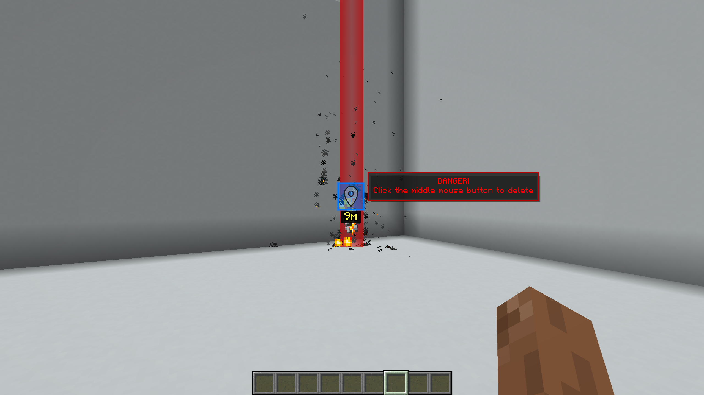
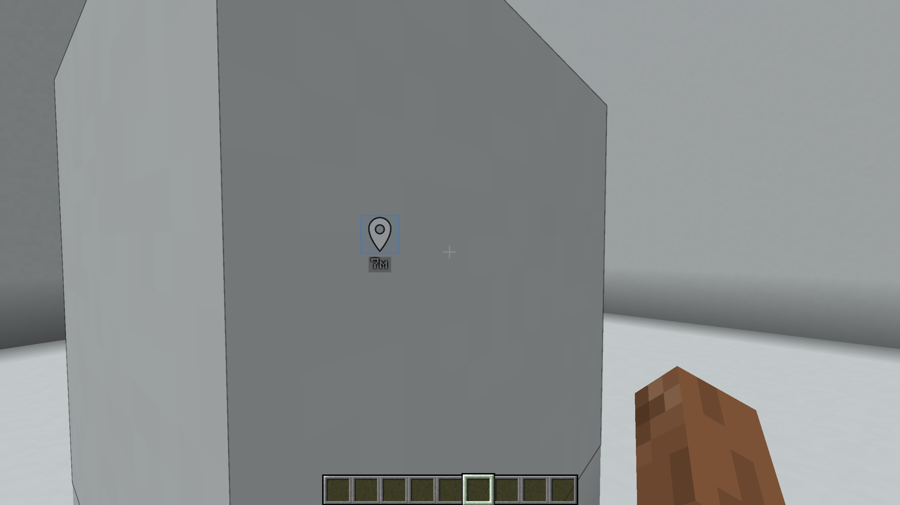

# QuickMark

[](https://modrinth.com/mod/quickmark)
[](https://github.com/UnknKriod/quickmark)

A Minecraft Fabric mod that brings Fortnite's marker and team HUD system to Minecraft.

## 📥 Installation

### For Players

1.  Install [Fabric Loader](https://fabricmc.net/use/) (0.14.0+) for Minecraft 1.21.7+
2.  Install the [Fabric API](https://modrinth.com/mod/fabric-api) (0.16.14+)
3.  Download the latest version of Quickmark from [Modrinth](https://modrinth.com/mod/quickmark)
4.  Place the `.jar` file into your `mods` folder

### For Servers

*   **Fabric Server:** Simply add the QuickMark mod to the `mods` folder.
*   **Spigot/Paper (Recommended):** For optimal performance and compatibility, install the **[QuickMark Plugin](https://modrinth.com/plugin/quickmark_pl)** into the `plugins` folder. The mod will automatically switch to plugin-based communication.

# Usage

## Marker System

* **Single mouse wheel click** — place a normal marker
* **Double mouse wheel click** — place a danger marker







Markers sync automatically across your team and play sound notifications.

## Team Management

**Invite players:**

```
/qm invite <player>
```

**Leave the team:**

```
/qm leave
```

## Accepting Invitations

When you receive an invite, a notification will appear. Press `Y` (default key, customizable in Minecraft's Controls menu) to accept.

## Team HUD

When you're in a team, a HUD appears showing the health of all teammates.


# 🛠️ For Server Administrators

QuickMark uses two communication methods:

1.  **Via Plugin (Recommended)** — Offers the best performance and reliability. [Download the plugin here](https://modrinth.com/plugin/quickmark_pl).
2.  **Via Chat (Fallback)** — If the plugin is not found, the mod uses chat messages prefixed with `quickmark://`.

**⚠️ Crucial for Fallback Mode:** If you are not using the server plugin, ensure that your chat or anti-cheat plugins do **not** filter or remove messages starting with `quickmark://`, as this will break the mod's team and marker synchronization.

## Known Issues

* The marker icon experience a slight positional offset from the exact center of the crosshair, depending on the camera's pitch and yaw.

## Plans

* GUI for inviting and managing players.
* Some overlays from Fortnite (similar to the invitation overlay)
* Add a distance check to set the marker, because now if I want to take a block with the mouse wheel, the marker is set on this block

# ⭐ Inspiration

The mod is inspired by Fortnite’s intuitive marker system, designed to enhance team coordination and communication in Minecraft.

---

### 🚀 **Pull Requests are welcome!** 🙌


Inspired by Fortnite’s intuitive marker system, designed to enhance team coordination and communication in Minecraft.

---

### 🚀 Contributing

Pull Requests are welcome! Please feel free to submit issues and contributions on our [GitHub repository](https://github.com/UnknKriod/quickmark).

For development setup, clone the repo and run `./gradlew build`.